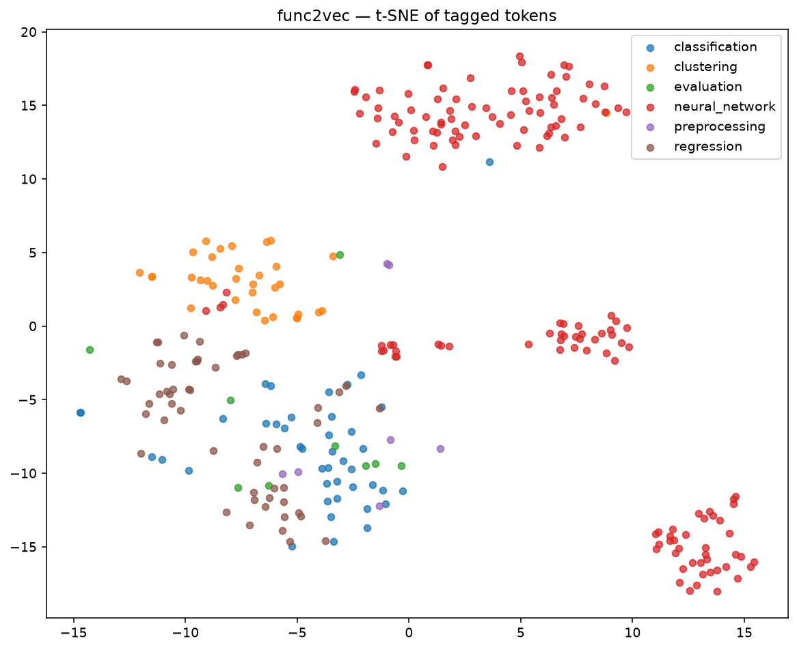

# func2vec — demo run

Full end-to-end run on a live corpus scraped from GitHub in this session.

## Corpus

- **Search queries**: 15 (sklearn.cluster, .linear_model, .ensemble, .svm, .decomposition, .model_selection, .preprocessing, .metrics, .pipeline; torch.nn, torch.utils.data; tensorflow.keras, keras.layers; xgboost; lightgbm).
- **Hits after dedup**: 2144 unique file blobs.
- **Files fetched**: 2140 (99.8% of hits — a handful of 404s from renamed default branches).
- **Sequences kept** (`--min-len 3`): 1820 files, 320 dropped as too sparse.
- **Raw vocabulary**: 2359 distinct ML calls. After `--min-count 3` the trained vocabulary is **1400 tokens**.

## Model

- Skip-gram, 100-dim, window=5, 15 epochs (gensim `Word2Vec` defaults for the rest).
- Silhouette by task-tag: **0.22** across `{clustering, classification, regression, neural_network, preprocessing, evaluation}` (n=297 tagged tokens). Positive and non-trivial — the tags do cluster in embedding space — but not tight, because a lot of ML tokens legitimately span tags (`sklearn.metrics.*` shows up in every task family).



## Nearest neighbors — highlights

Semantically clean neighborhoods, straight from the trained embedding:

**`torch.nn.Conv2d`** (all 2D CNN building blocks, ≥0.93 cosine)
```
0.962  torch.nn.Dropout2d
0.950  torch.nn.BatchNorm2d
0.949  torch.nn.ReflectionPad2d
0.940  torch.nn.Upsample
0.938  torch.nn.MaxPool2d
0.935  torch.nn.ZeroPad2d
0.934  torch.nn.AvgPool2d
0.933  torch.nn.AdaptiveAvgPool2d
```

**`torch.nn.Linear`** (dense/regularization companions)
```
0.955  torch.nn.Dropout
0.949  torch.nn.LSTM
0.941  torch.nn.utils.weight_norm.weight_norm
0.932  torch.nn.LayerNorm
0.924  torch.nn.init.zeros_
0.915  torch.nn.Sigmoid
0.913  torch.nn.Softmax
```

**`keras.layers.Dense`**
```
0.945  keras.layers.Dropout
0.929  keras.layers.concatenate
0.927  keras.layers.PReLU
0.922  keras.layers.Flatten
0.921  keras.layers.TimeDistributed
0.918  keras.layers.LSTM
```

**`sklearn.svm.SVC`** — clusters with related kernel classifiers plus its typical wrappers
```
0.866  sklearn.svm.NuSVC
0.768  sklearn.svm._libsvm.cross_validation
0.765  sklearn.model_selection.RepeatedStratifiedKFold
0.761  sklearn.svm.NuSVR
0.754  sklearn.calibration.CalibratedClassifierCV
0.751  sklearn.metrics.ConfusionMatrixDisplay.from_estimator
```

**`sklearn.ensemble.RandomForestClassifier`** — the embedding groups it with other tabular classifiers *including* cross-library
```
0.772  sklearn.ensemble.ExtraTreesClassifier
0.769  sklearn.naive_bayes.GaussianNB
0.764  sklearn.linear_model.PassiveAggressiveClassifier
0.728  xgboost.sklearn.XGBClassifier
```

**`xgboost.XGBClassifier`** — nearest cross-library neighbor is `lightgbm.LGBMClassifier` at 0.79 cosine. The embedding learned that these two libraries are semantic substitutes even though we never told it so.
```
0.793  xgboost.plot_importance
0.791  lightgbm.LGBMClassifier
0.784  scipy.stats.randint
0.781  xgboost.sklearn.XGBClassifier
```

## Chain synthesis

`chain.py` greedily rolls out a pipeline by picking the nearest-neighbor of the current chain's mean vector at each step. Same-module constraint on by default.

**Seed: `sklearn.cluster.KMeans`** → recovers a picture-perfect cluster-evaluation pipeline
```
→ sklearn.metrics.silhouette_score          (sim=0.678)
→ sklearn.metrics.davies_bouldin_score      (sim=0.841)
→ sklearn.metrics.silhouette_samples        (sim=0.865)
→ sklearn.metrics.homogeneity_score         (sim=0.837)
→ sklearn.metrics.completeness_score        (sim=0.902)
```

**Seed: `torch.nn.Conv2d`** → CNN block catalog
```
→ torch.nn.Dropout2d          (sim=0.962)
→ torch.nn.ReflectionPad2d    (sim=0.970)
→ torch.nn.Upsample           (sim=0.966)
→ torch.nn.ZeroPad2d          (sim=0.968)
→ torch.nn.MaxPool2d          (sim=0.974)
```

**Seed: `keras.layers.Dense`**
```
→ keras.layers.Dropout        (sim=0.945)
→ keras.layers.LSTM           (sim=0.952)
→ keras.layers.TimeDistributed (sim=0.954)
→ keras.layers.concatenate    (sim=0.966)
→ keras.layers.merge          (sim=0.974)
```

**Seed: `xgboost.XGBClassifier`**
```
→ xgboost.plot_importance     (sim=0.793)
→ xgboost.sklearn.XGBClassifier (sim=0.843)
→ xgboost.train               (sim=0.801)
→ xgboost.DMatrix             (sim=0.824)
→ xgboost.Booster             (sim=0.777)
```

## What went wrong (worth documenting)

Two seeds produced chains full of `sklearn.utils.estimator_checks._enforce_estimator_tags_X`, `sklearn.utils._estimator_html_repr._get_visual_block`, and other sklearn internals:

**Seed: `sklearn.linear_model.LogisticRegression`**
```
→ sklearn.inspection._plot.decision_boundary._check_boundary_response_method
→ sklearn.dummy.DummyClassifier
→ sklearn.utils._test_common.instance_generator._construct_instances
→ sklearn.utils.estimator_checks._enforce_estimator_tags_y
→ sklearn.utils.estimator_checks._enforce_estimator_tags_X
```

Root cause: **the corpus includes sklearn's own repository**, whose test files import and use every estimator densely. That makes sklearn's test scaffolding a co-occurrence hub with every algorithm token — the embedding correctly picks up that these are the tokens most often "near" any estimator, but from the user's perspective they're noise.

Two mitigations for next iteration:
1. Drop files whose repo is one of the library projects themselves (`scikit-learn/scikit-learn`, `pytorch/pytorch`, `keras-team/keras`, …).
2. Add a stopword filter on names matching `sklearn.utils.*`, `sklearn.tests.*`, `*_estimator_checks*`.

The clean seeds (Conv2d, KMeans, Dense, XGBClassifier) work because their nearest neighborhood is already dominated by domain-appropriate tokens; the noise seeds are the ones where sklearn's testing tokens outrank the actual use-companion tokens.

## Reproduce

```bash
pip install -r ../requirements.txt
python -m func2vec.scrape --from-hits             # if data/hits.jsonl exists
python -m func2vec.extract --min-len 3
python -m func2vec.train --size 100 --epochs 15
python -m func2vec.evaluate
python -m func2vec.chain --seed sklearn.cluster.KMeans --steps 5
```
