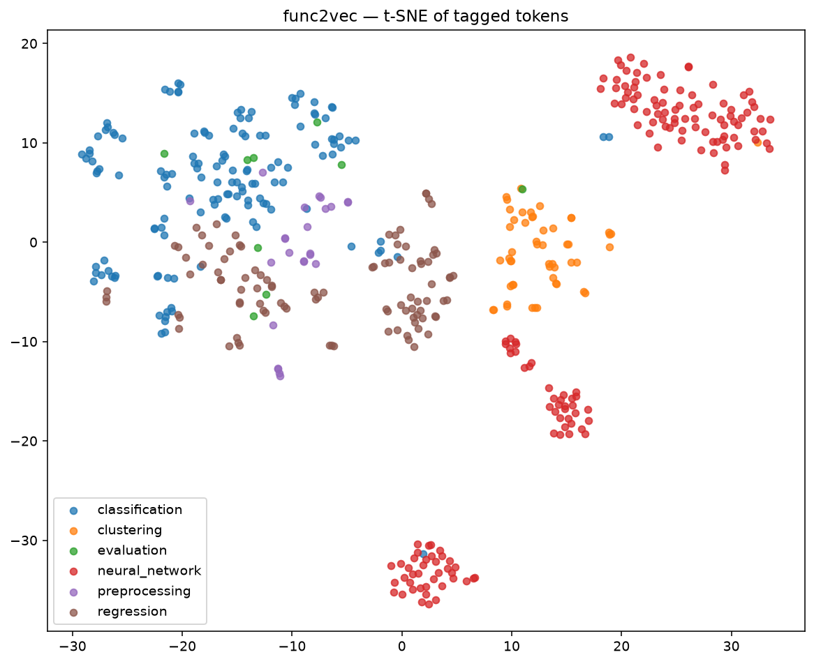

# func2vec v2 — after the mitigations

Second iteration on the same 2140 scraped files. v2 changes are extractor-only; no new corpus.

## What changed

1. **Repo blocklist** — drop files from library-implementation repos (`scikit-learn/scikit-learn`, `pytorch/pytorch`, `keras-team/keras`, `tensorflow/tensorflow`, `dmlc/xgboost`, `microsoft/lightgbm`, `pandas-dev/pandas`, `huggingface/transformers`, …). In this corpus that blocked 0 files — the sklearn contamination in v1 wasn't from scraping sklearn itself, it was from user scripts importing internal helpers.
2. **Token stopwords** — drop tokens matching `sklearn.utils.*`, `sklearn.tests.*`, `sklearn.*._<lowercase>*`, `*.estimator_checks.*`, `sklearn.inspection._plot.*`, `sklearn.experimental.*`, `sklearn.datasets.samples_generator.*`. This is what actually removed the pollution in v1.
3. **Method-call resolution** — track `var = SomeClass(...)` assignments (including chained `a = b = X()` and `x = existing_var` propagation) and, when `var.method(...)` appears later, emit `SomeClass.method` as a token. This recovers the `.fit` / `.predict` / `.transform` / `.compile` / etc. that were invisible in v1 and are the actual mechanics of an ML pipeline.

## Corpus / model stats

| metric                | v1     | v2     |
|-----------------------|--------|--------|
| raw files             | 2140   | 2140   |
| sequences kept        | 1820   | 1862   |
| raw vocabulary        | 2359   | 2848   |
| trained vocabulary    | 1400   | **1668** |
| task-tag silhouette   | 0.222  | 0.205  |
| tagged tokens (silh.) | 297    | 484    |

Vocabulary grew ~19% from the new method-call tokens. The silhouette dropped very slightly, which is expected — we're now covering 63% more tagged tokens (many are `Class.method` names that legitimately span task tags), so tighter clustering isn't the right target.



## Before / after — the two seeds that were broken in v1

**`sklearn.linear_model.LogisticRegression` — nearest neighbors**

_v1 (broken):_
```
0.665  sklearn.inspection._plot.decision_boundary._check_boundary_response_method
0.665  sklearn.dummy.DummyClassifier
0.662  sklearn.datasets.make_classification
0.653  sklearn.datasets.load_breast_cancer
0.643  sklearn.utils.fixes.trapezoid
```

_v2 (fixed):_
```
0.763  sklearn.linear_model.LogisticRegression.fit
0.732  sklearn.linear_model.LogisticRegressionCV.predict_proba
0.731  sklearn.metrics.PrecisionRecallDisplay.from_estimator
0.723  sklearn.linear_model.LogisticRegression.get_params
0.712  sklearn.linear_model.LogisticRegressionCV.predict
```

**`sklearn.decomposition.PCA` — nearest neighbors**

_v1:_
```
0.671  sklearn.manifold.TSNE
0.648  sklearn.utils._estimator_html_repr._get_visual_block
0.645  sklearn.impute.SimpleImputer
0.642  sklearn.impute.KNNImputer
0.636  sklearn.feature_selection.SelectPercentile
```

_v2:_
```
0.775  sklearn.decomposition.PCA.fit_transform
0.744  sklearn.neighbors.KNeighborsClassifier.kneighbors
0.740  sklearn.pipeline.Pipeline.score_samples
0.740  sklearn.decomposition.PCA.fit
0.657  sklearn.impute.SimpleImputer.transform
```

## Chain synthesis — now shows real workflow

**Seed: `xgboost.XGBClassifier`** — full lifecycle emerges
```
→ xgboost.XGBClassifier.fit           (sim=0.855)
→ xgboost.XGBClassifier.get_booster   (sim=0.922)
→ xgboost.XGBClassifier.predict       (sim=0.919)
→ xgboost.XGBClassifier.score         (sim=0.933)
→ xgboost.XGBClassifier.predict_proba (sim=0.892)
→ xgboost.XGBClassifier.load_model    (sim=0.861)
```

**Seed: `sklearn.linear_model.LogisticRegression`**
```
→ sklearn.linear_model.LogisticRegression.fit                (sim=0.763)
→ sklearn.linear_model.LogisticRegression.score              (sim=0.802)
→ sklearn.linear_model.LogisticRegressionCV.predict          (sim=0.840)
→ sklearn.linear_model.LogisticRegressionCV.predict_proba    (sim=0.851)
→ sklearn.linear_model.LogisticRegression.predict_proba      (sim=0.849)
→ sklearn.linear_model.LogisticRegressionCV                  (sim=0.842)
```

**Seed: `sklearn.cluster.KMeans`**
```
→ sklearn.cluster.KMeans.fit                (sim=0.829)
→ sklearn.cluster.KMeans.get_feature_names_out (sim=0.773)
→ sklearn.cluster.KMeans.transform          (sim=0.820)
→ sklearn.metrics.cluster.v_measure_score   (sim=0.879)
→ sklearn.cluster.k_means                   (sim=0.893)
```

**Seed: `torch.nn.Conv2d`** — CNN block catalog now includes a normalization layer trio (Batch, Instance, spectral)
```
→ torch.nn.BatchNorm2d           (sim=0.958)
→ torch.nn.MaxPool2d             (sim=0.955)
→ torch.nn.utils.spectral_norm   (sim=0.973)
→ torch.nn.ZeroPad2d             (sim=0.979)
→ torch.nn.InstanceNorm2d        (sim=0.982)
→ torch.nn.ELU                   (sim=0.981)
```

## What still needs work

- **Cross-class propagation is limited.** We only track `var = Class()` and simple `x = existing_var`; we don't follow calls that return an instance (`clf = GridSearchCV(...).fit(X).best_estimator_`). That's the next high-value extractor improvement.
- **Method-call resolution is still surface-only.** `pipeline = make_pipeline(scaler, pca, clf); pipeline.fit(X)` doesn't recover `Pipeline.fit` because we don't know the return type of `make_pipeline`.
- **Task-tag heuristic is coarse.** Method tokens (`X.fit`, `X.predict`) get inherited task tags from their class, but many methods are genuinely task-agnostic. A better evaluation would score chain plausibility against real files instead of silhouette against keyword tags.
